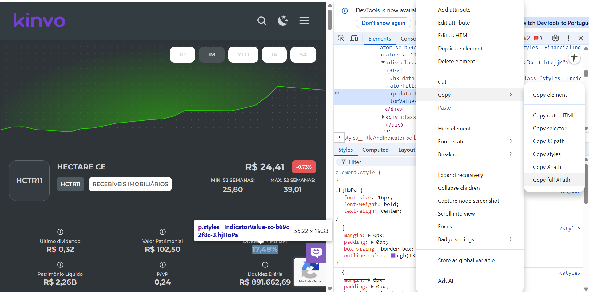

# 📊 Simulador de FIIs - Curso Excel com Inteligência Artificial DIO-Santander

Uma planilha interativa e didática desenvolvida para auxiliar investidores na simulação de aportes e projeção de rendimentos com Fundos Imobiliários (FIIs).
Desenvolvida como projeto para o Curso Excel com Inteligência Artificial DIO-Santander

---

## ⚙️ Funcionalidades

- 💰 Parâmetros personalizáveis:
  - Aporte Mensal
  - Rentabilidade Mensal (%)
  - Tempo de Investimento (anos)
-  Parâmetros automatizados:
  - Parâmetros utilizados:
      - Rentabilidade mensal sugerida usando dados ao vivo (atualizados a cada 20 minutos) de FIIs importados do website Kinvo.com.br.
      - Preço real de cada cota de FIIs usando dados ao vivo (atualizados a cada 20 minutos) importados do Google Finance.
      - Taxa real de retorno usando dados ao vivo (atualizados a cada 20 minutos) importados do website do IBGE.
  - Metodologia:
      - Foi utilizado a função =importxml no Google Sheets e, ao selecionar o dado desejado, copiado o XPath completo no Dev Tools do Google Chrome para ser incorporado na função . Este método foi usado para obter rentabilidade mensal e dado de inflação para cálculo da taxa real de retorno. Também foi utilizado a função =googlefinance para obter os preços das cotas de FIIs.
      - Após isso, foi obtido o link da planilha do Google Sheets e esta foi importada para o Excel através de Obter Dados da Web (aba Dados), e configurados para atualizar a cada 5 minutos e habilitado a atualização em segundo plano.
- 📈 Projeção mês a mês do patrimônio acumulado e dividendos recebidos.
- 📉 Gráficos automáticos:
  - Evolução do Patrimônio
  - Dividendos Mensais
- 🖱️ Barra deslizante (controle de formulário) para alterar o tempo de investimento dinamicamente.

---

## 🧾 Como Usar

1. Baixe e abra o arquivo `Simulador_FIIs_TB_Investimentos.xlsx` no Microsoft Excel.
2. Acesse a aba **Dashboard**.
3. Edite os campos de simulação conforme seu perfil de investidor.
4. Os resultados e projeções aparecerão automaticamente na mesma aba, com gráficos.

---

## 🛠️ Requisitos

- Microsoft Excel 2016 ou superior (para suportar fórmulas, gráficos e controles)

---

## 📷 Captura de Tela (sugestão)

> Insira aqui uma imagem da planilha em funcionamento (adicione à pasta `/img` e atualize o link abaixo)

---

## 🧠 Autor

Thiago Brassanini
tbrassanini@gmail.com
