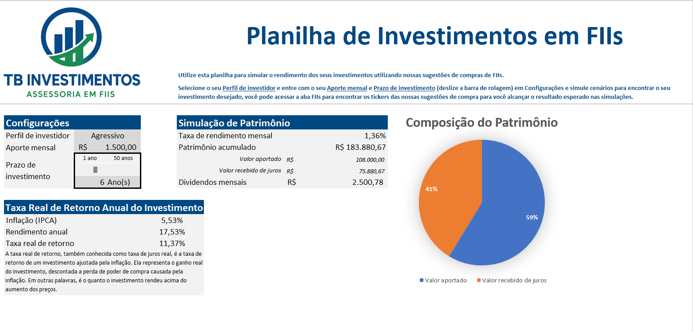

# 📊 Simulador de FIIs - Curso Excel com Inteligência Artificial DIO-Santander

Uma planilha interativa e didática desenvolvida para auxiliar investidores na simulação de aportes e projeção de rendimentos com Fundos Imobiliários (FIIs).
Desenvolvida como projeto para o Curso Excel com Inteligência Artificial DIO-Santander

---

## ⚙️ Funcionalidades

-  Parâmetros personalizáveis:
  - Aporte Mensal
  - Rentabilidade Mensal (%)
  - Tempo de Investimento (anos)
-  Parâmetros automatizados:
  - Parâmetros utilizados:
      - Rentabilidade mensal sugerida usando dados ao vivo (atualizados a cada 20 minutos) de FIIs importados do website Kinvo.com.br.
      - Preço real de cada cota de FIIs usando dados ao vivo (atualizados a cada 20 minutos) importados do Google Finance.
      - Taxa real de retorno usando dados ao vivo (atualizados a cada 20 minutos) importados do website do IBGE.
  - Metodologia:
      - Foi utilizado a função =importxml no Google Sheets (https://github.com/tbrssnn/planilha-investimentos-fiis/raw/main/images/importxml.png) e, ao selecionar o dado desejado, copiado o XPath completo no Dev Tools do Google Chrome para ser incorporado na função (https://github.com/tbrssnn/planilha-investimentos-fiis/raw/main/images/xpath.png). Este método foi usado para obter rentabilidade mensal e dado de inflação para cálculo da taxa real de retorno. Também foi utilizado a função =googlefinance para obter os preços das cotas de FIIs.
      - Após isso, foi obtido o link da planilha do Google Sheets e esta foi importada para o Excel através de Obter Dados da Web (aba Dados), e configurados para atualizar a cada 5 minutos e habilitado a atualização em segundo plano.
- Gráficos automáticos de Composição do Patrimônio, mostrando os valores que vieram dos aportes do investidor e o que foi gerado pelos juros
- Barra deslizante (controle de formulário) para alterar o tempo de investimento dinamicamente.

## 📥 Download

Baixe o simulador em Excel clicando aqui:  
👉 [Download Projeto - Versao Final.xlsx]((https://github.com/tbrssnn/planilha-investimentos-fiis/raw/main/files/Projeto-Versao Final.xlsx))

## 🧾 Como Usar

1. Baixe e abra o arquivo `Simulador_FIIs_TB_Investimentos.xlsx` no Microsoft Excel.
2. Acesse a aba **Dashboard**.
3. Edite os campos de simulação conforme seu perfil de investidor. Os campos que o usuário pode alterar estão em Configurações, todo o resto da planilha é automatizado. No cabeçalho da planilha estão mais informações sobre os campos que o usuário deve entrar com informações.
4. Os resultados e projeções aparecerão automaticamente na mesma aba, com gráficos.
5. Depois de simular os cenários o investidor pode conferir na aba FIIs os tickers dos FIIs sugeridos e o seu preço de compra.

---

## 🛠️ Requisitos

- Microsoft Excel 2016 ou superior (para suportar fórmulas, gráficos e controles)

---

## 📷 Captura de Tela 

---

## 🧠 Autor

Thiago Brassanini
tbrassanini@gmail.com
